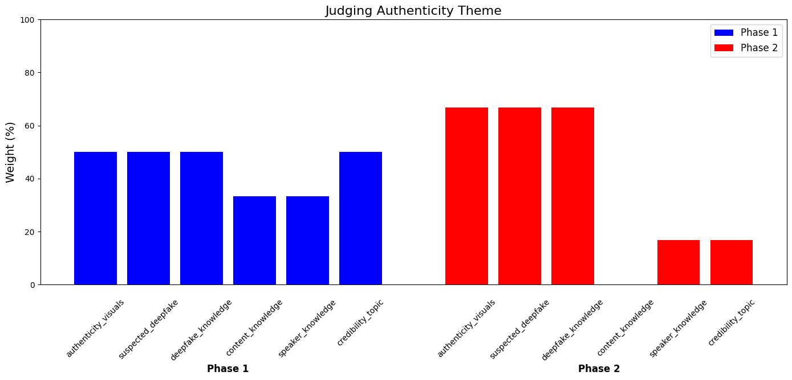
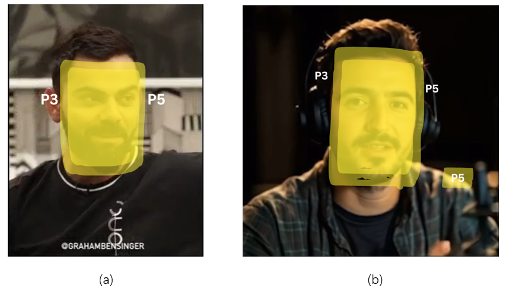
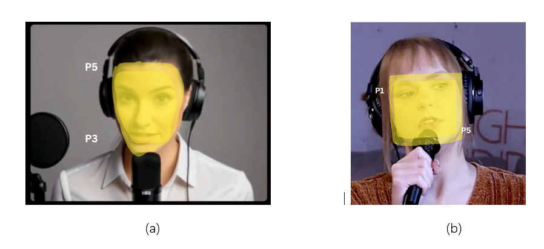

# Human-Attentions-on-Deep-Fake-Media
# Exploring the Impact of Deepfake Warnings on People's Video Perception

**Author:** Venkatanaveenkumar P

**Institution:** The Pennsylvania State University

**Relevance:** Human Factors of Security and Privacy

---

## Project Overview

With the rapid advancement of Artificial Intelligence, deepfake technology can produce hyper-realistic videos that convincingly portray people doing or saying things that never happened. This poses a significant threat of misinformation, especially when spread through social media.

This research project explores the cognitive and psychological impact of **deepfake warning labels** on a viewer's perception and attention. While prior research shows that warning labels can reduce the spread of misinformation, their effect on video content is less understood. Our study investigates how viewers' attention shifts when they are warned that a video might be a deepfake, aiming to provide insights for designing more effective warning mechanisms.

---

## Research Questions

This study was guided by two primary research questions:

1.  **RQ1:** How does a user's attentional focus differ between videos labeled with a deepfake warning and unlabeled videos?

2.  **RQ2:** Does the presence of a 'deepfake warning' label on one video influence viewers' attentional focus on a subsequent, unlabeled video?

---

## Methodology

We employed a **mixed-method approach**, combining qualitative thematic analysis of interview transcripts with quantitative analysis of coded data.

Six participants were interviewed in a two-phase study:

* **Phase 1:** Participants watched a set of real and deepfake videos *without* any warning labels and provided feedback on their focus and perception.

* **Phase 2:** Participants were shown a deepfake warning label ("The video might be generated by AI") before watching a second set of videos.

Participant responses were transcribed, and a codebook was developed to thematically analyze attention shifts, perceptions of authenticity, and cognitive reactions. The inter-coder agreement score (Cohen's Kappa) was **0.91**, indicating strong reliability.

### Codebook and Analysis Process

Our analysis involved a rigorous process of codebook refinement and theme weight calculation to interpret the interview data.


*Figure 1: The process used for codebook refinement and theme weight calculation.*

---

## Key Findings

Our analysis revealed several key insights into how warning labels affect viewers:

1.  **Attention Shifts from Content to Artifacts:** The presence of a warning label caused participants to shift their attention away from the video's spoken content and towards specific visual elements. They began actively hunting for "flaws"—unnatural facial expressions, odd lip movements, or background inconsistencies—to judge the video's authenticity.

2.  **Focus Shifts from Emotion to Judgment:** Without a warning, participants often discussed their emotional reactions to the video's topic. After a warning was introduced, their focus shifted almost entirely to judging whether the video was real or fake, largely ignoring the emotional or narrative content.

3.  **Warning Labels Have a "Spillover" Effect:** A warning on one video heightened participants' skepticism for subsequent videos, even those without a warning label. This suggests that a single warning can temporarily alter a user's general media consumption behavior, making them more critical of all content.

4.  **Effectiveness Depends on Prior Attitude:** The impact of a warning label is not uniform. Its effectiveness was diminished for participants who were either already highly vigilant about deepfakes or who felt the video's topic was not important enough to warrant scrutiny.

### Visualizing Attention Shifts

The attention heatmaps below, generated from participants' self-reported focus areas, visually demonstrate the change in attention.

**Phase 1 (No Warning):** Attention is generally focused on the speaker's face as a whole.


*Figure 2: Attention heatmap from Group 1 (Phase 1), showing focus on the face and background.*

**Phase 2 (With Warning):** After a warning, attention becomes more dispersed and targeted, focusing on specific "suspicious" elements like the mouth, hands, or subtitles, even in a real video.


*Figure 3: Attention heatmap from Group 6 (Phase 2), showing fragmented focus on the mouth, hands, and subtitles.*

---

## Conclusion & Recommendations

Our study demonstrates that deepfake warning labels are effective at raising viewer awareness and prompting critical evaluation. However, this comes at the cost of distracting viewers from the video's actual content. The effectiveness of labels is also moderated by an individual's prior knowledge and attitude.

Based on our findings, we propose the following recommendations for designing **more effective warning labels**:

* **Provide Contextual Summaries:** Include a brief, neutral summary of the video's content alongside the warning to reduce the viewer's cognitive load, allowing them to focus on authenticity without losing the core message.

* **Reinforce the "Why":** Add prompts that explain the potential harm of deepfakes (e.g., "Deepfakes can spread misinformation") to increase the perceived importance of vigilance.

* **Persistent Display:** Display the warning label continuously throughout the video, rather than just at the beginning, to maintain viewer awareness.

---

## Limitations

This study was subject to several limitations:

* **Small Sample Size:** The study involved six participants, limiting the generalizability of the findings.

* **Participant Background:** A majority of participants had a background in technology, which may have made them more aware of deepfakes than the general population.

* **Lack of Ground Truth:** We did not use a computational model to establish a definitive "ground truth" for whether participants' judgments were accurate, which could enhance future research.

---

## How to Cite This Work

```
Venkatanaveenkumar Prabhuleti. 2024. Exploring the Impact of Deepfake Warnings on People's Video Perception. In Proceedings of the 2024 Final Project Paper IST 577: Human Factors of Security and Privacy, The Pennsylvania State University, University Park, December 11, 2024.
